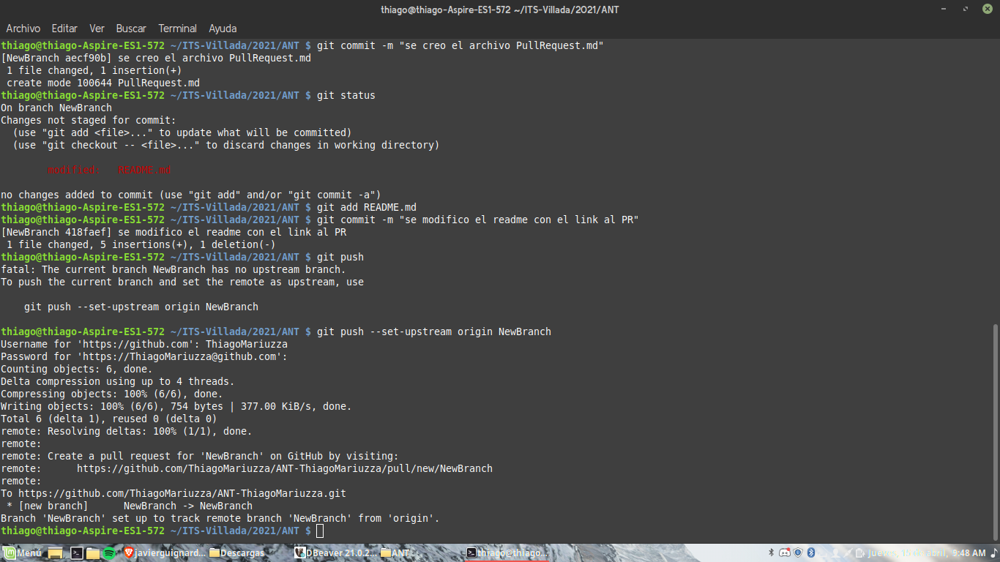
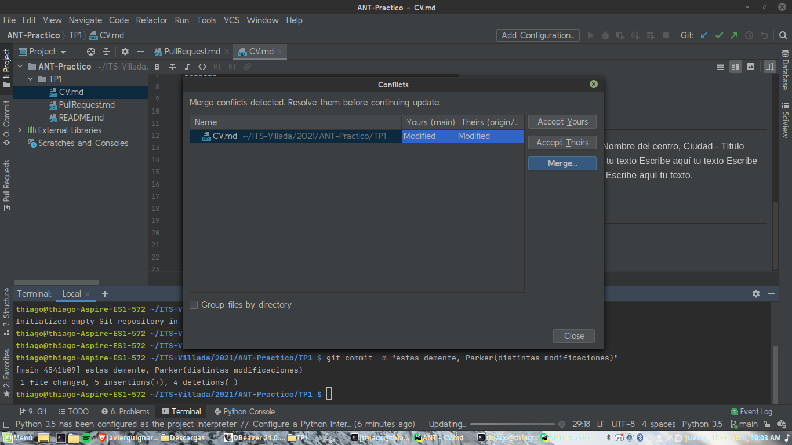
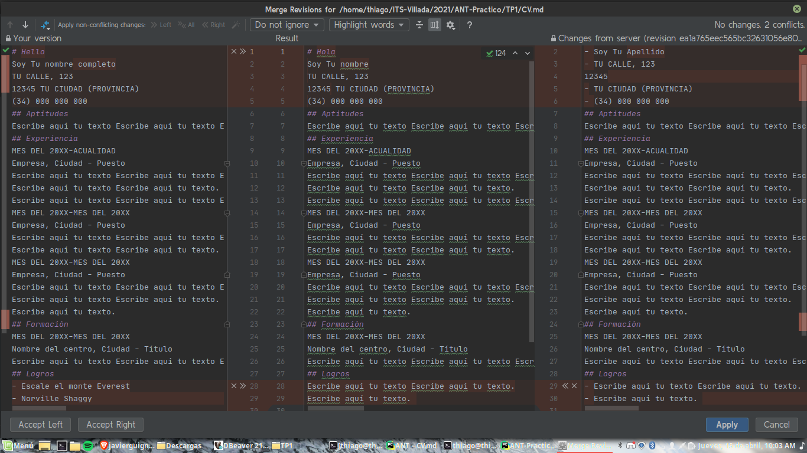
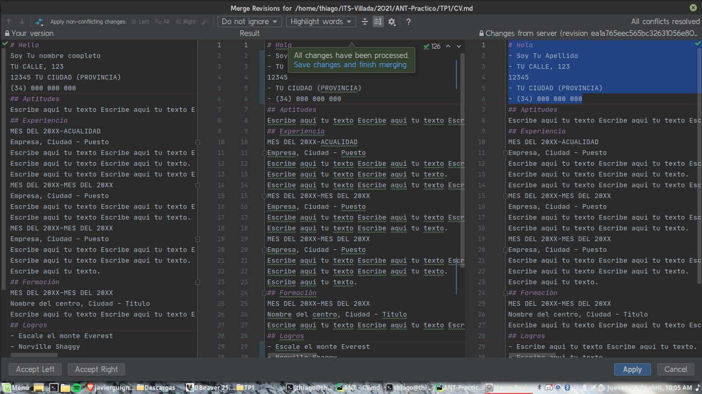
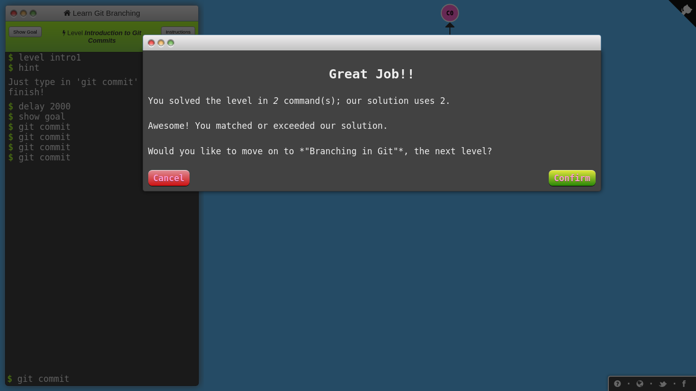
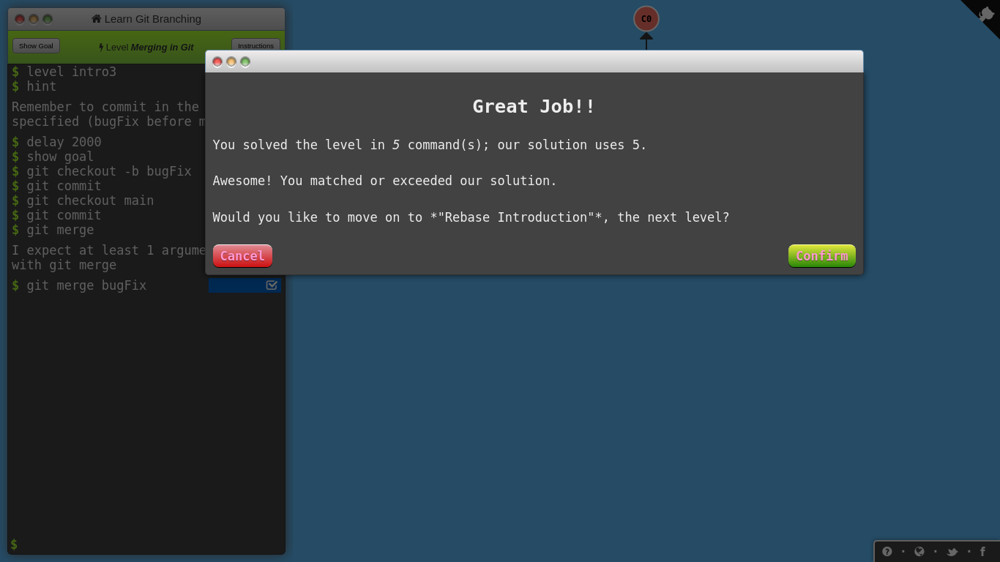
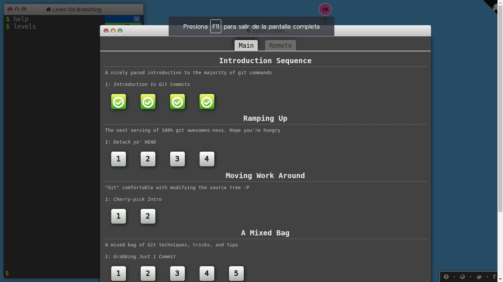

- [link a cv](CV.md)
- [link Pull Request](PullRequest.md)

## Desarrollo:
#### 1. Instalar Git
#### 2. Crear un repositorio local y agregar archivos
#### 3. Crear un repositorio remoto
#### 4- Familiarizarse con el concepto de Pull Request

#### 5- Mergear código con conflictos

#### 6- Algunos ejercicios online

